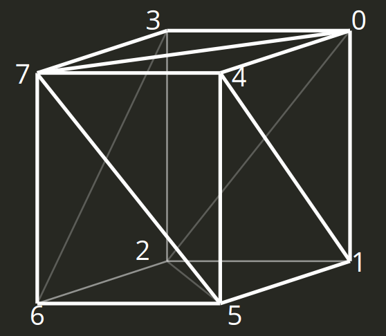
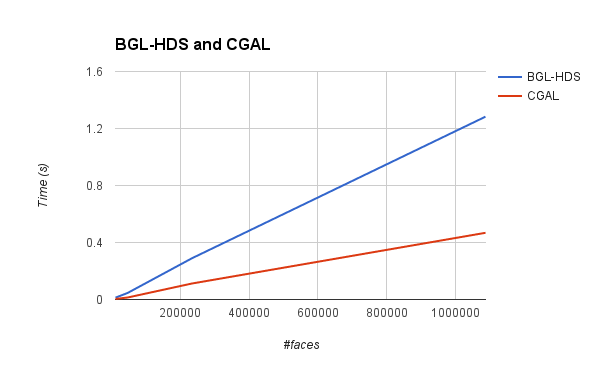

<div align="center">
<h3>CSCE 622: Generic Programming -- Final Project Report</h3>
<h4>Peihong Guo UIN: 421003404</h4>
</div>

### Project title: Half-edge Data Structure using BGL

#### User's Guide
Half-edge data structure is an important data structure for representing and manipulating 3D mesh data in computational geometry. A generic implementation of half-edge data structure could be used in various computational geometry algorithms, including mesh simplification, repair and constructive solid geometry, that rely on this data structure.

Excellent implementations of HDS are available in the public domain, among which are the [CGAL implementation](http://doc.cgal.org/latest/HalfedgeDS/index.html) and [OpenMesh library](http://www.openmesh.org/). However, one of the common issues with these specialized libraries is the relatively steep learning curve. The need to providing generic data structure and the tight coupling with many related components make the implementations in these libraries over-complicated such that users have to invest a significant amount of time studying the library before actually utilizing it to solve problems at hand. A light-weight, easy to use library is therefore needed in cases where efficiency is more important.

The main goal of this project is to implement a light-weight generic half-edge data structure using BGL. This an experimental effort towards implementing half-edge data structure using [boost graph library](http://www.boost.org/doc/libs/1_59_0/libs/graph/doc/table_of_contents.html) (BGL), where the library is designed as a wrapper for basic boost graphs to mimic half edge data structure. Theoretically, any graph offered in BGL could serve as the underlying graph for representing HDS. The performance of the resulting HDS is expected to vary significantly given different choice of basic graph.

The user of this library is assumed to have basic knowledge of BGL, and a basic background in computer graphics. Familiarity with the concept of half edge data structure would be a big help in understanding how this implementation works.

##### List of Sources
1. [Half edge data structure in CGAL](http://doc.cgal.org/latest/HalfedgeDS/index.html)
2. [Boost graph library](http://www.boost.org/doc/libs/1_59_0/libs/graph/doc/table_of_contents.html)
3. [OpenMesh library](http://www.openmesh.org/)
4. [Mesh simplification in CGAL]( http://doc.cgal.org/latest/Surface_mesh_simplification/)
5. [Mesh deformation]( http://www.cse.wustl.edu/~taoju/cse554/lectures/lect08_Deformation.pdf)

#### Reference Manual

##### Concepts
###### HalfEdgeDataStructure
A half edge datas structure is an object that stores the vertices, edges and faces of a triangular mesh. It maintains the incidence information among its elements:
* Each vertex has an out-going halfedge
* Each full edge corresponds to 2 twin halfedges
* Each face has an incident halfedge
* Each halfedge has the following members
  1. an incident vertex handle
  2. an incident face handle (face on the left)
  3. an incident edge handle
  4. an opposite halfedge handle
  5. a prev halfedge handle

###### HDSVertex
`HDSVertex` defines the requirements for the vertex type in the `HalfEdgeDataStructure` concept. It is a class template that stores a handle to a halfedge item and its own property.

It refines the concepts `ConpyConstructible` and `DefaultConstructible`.

###### HDSFace
`HDSFace` defines the requirements for the face type in the `HalfEdgeDataStructure` concept. It is a class template that stores a handle to a halfedge item and its own property.

It refines the concepts `ConpyConstructible` and `DefaultConstructible`.

###### HDSEdge
`HDSEdge` defines the requirements for the edge type in the `HalfEdgeDataStructure` concept. It is a class template that stores a handle to its source vertex item, a handle to the face on the left, its previous, next and twin halfedge(flip), and its own property.

It refines the concepts `ConpyConstructible` and `DefaultConstructible`.

###### Iterators
Iterators are objects used to iterate through a range of objects, for example, vertices and edges.

###### Circulators
Circulators in fact a special type of iterators used to iterate through adjacent elements of a given element in `HalfEdgeDataStructure`.

#### Design Document
##### HDS as augmented bidirectional graphs
Half edge data structure can be modeled as an augmented bidirectional graph, where vertices and edges are augmented with extra information to enable constant time access to their adjacent elements. Faces of a triangle mesh are modeled as graph level property in addition:

```cpp
template <typename VertexProperty, typename EdgeProperty, typename FaceProperty>
struct DefaultHalfedgeDataStructureTraits {
  template <typename VP, typename EP, typename GP>
  using g = adjacency_list<listS, listS, bidirectionalS, VP, EP, GP>;

  ... // lots of types

  typedef HDSVertex<edge_descriptor, VertexProperty> vertex_type;
  typedef HDSEdge<edge_descriptor, vertex_descriptor,
                  face_descriptor, EdgeProperty> edge_type;
  typedef HDSFace<edge_descriptor, FaceProperty> face_type;
  struct face_properties {
    ... // containers of face_type and some helpers
  };

  typedef g<vertex_type, edge_type, face_properties> graph_type;
};
```

where `HDSVertex`, `HDSEdge` and `HDSFace` are defined as

```cpp
template <typename HalfedgeDescriptor, typename VertexProperty>
struct HDSVertex {
  ... // constructors and some helpers

  HalfedgeDescriptor he;
  VertexProperty prop;
};

template <typename HalfedgeDescriptor, typename VertexDescriptor,
          typename FaceDescriptor, typename EdgeProperty>
struct HDSEdge {
  ... // constructors and some helpers

  VertexDescriptor v;
  FaceDescriptor f;
  HalfedgeDescriptor flip, prev, next;
  EdgeProperty prop;
};

template <typename HalfedgeDescriptor, typename FaceProperty>
struct HDSFace {
  ... // constructors and some helpers

  HalfedgeDescriptor he;
  FaceProperty prop;
};
```

The reason for choosing `adjacency_list` in BGL as a base graph and model HDS as a bidirectional graph is to maximize utilization of the available functionalities in BGL. This significantly reduces the complexity of the data structure design. In order to keep this simplified data structure a generic HDS container, the elements in HDS are parameterized and `HalfEdgeDataStructure` is defined as a class template:

```cpp
template <typename VertexProperty, typename EdgeProperty, typename FaceProperty,
          typename Traits=DefaultHDSTraits<VertexProperty, EdgeProperty, FaceProperty>>
class HalfEdgeDataStructure {
public:
  typedef typename Traits::graph_type graph_type;

  ... // lots of types and member functions

private:
  graph_type g;  
}
```

##### Circulators
Three types of ciculators exists in HDS: vertex circulator, edge circulator and face circulator:
* Vertex circulator provides access to the vertices of a face or adjacent vertices of a vertex.
* Edge circulator provides access to edges of a face or incident edges of a vertex
* Face circulator provides access to incident faces of a vertex

These circulator share very similar behavior, yet each of them has its own variation. All of them traverses HDS locally through a sequence of halfedges, and the strategy of choosing edges for visiting varies from one circulator to another. The task to perform during the visiting is also different among them.

The circulator class template is designed to capture the common place of these circulators by abstracting the visiting pattern: the visitor and the traversal strategy are parameterized so that the circulator class act as a generic iterator that iterates through a sequence of halfedges following the traversal strategy and performs the task encapsulated inside the visitor class. That is, the circulator class template is designed as follows:

```cpp
template <class MeshType, typename Visitor>
class EdgeCirculator {
public:
  typedef MeshType mesh_type;
  typedef typename MeshType::graph_type graph_type;
  typedef typename MeshType::edge_descriptor edge_descriptor;
  typedef std::function<edge_descriptor(edge_descriptor, const graph_type&)> CirculationStrategy;

  EdgeCirculator(edge_descriptor he, const graph_type& g,
                 CirculationStrategy strategy);
  ... // common iterator operations, i.e ++, dereference and validity test.
};
```

#### Description and results of testing
##### Small example
Here shows a small example of using the implemented HDS to load and display a cube object:
```cpp
#include "hdsmesh.h"

#include <iostream>
#include <fstream>
#include <string>
using namespace std;

using point_t = glm::vec3;
struct color_t {
  float r, g, b, a;
};
using weight_t = double;

namespace std {
ostream& operator<<(ostream& os, glm::vec3 v) {
  os << "(" << v.x << ", " << v.y << ", " << v.z << ")";
  return os;
}
}

int main(int argc, char** argv) {
  // Load the mesh
  if(argc <= 1) {
    cout << "Usage: ./mesh_simplification mesh_file" << endl;
    return -1;
  }
  string filename(argv[1]);
  OBJLoader loader(filename);

  typedef HalfEdgeDataStructure<point_t, weight_t, color_t> hds_t;
  hds_t mesh;
  hds_t::build(loader.getFaces(), loader.getVerts(), mesh);

  std::cout << "# faces = " << mesh.size_of_facets() << "\n";
  std::cout << "# vertices = " << mesh.size_of_vertices() << "\n";
  cout << mesh << endl;

  return 0;
}
```

After executing the following command:
```
./build_hds cube.obj
```
where `cube.obj` is a cube object



The output is as follows:
```
# faces = 12
# vertices = 8
8 vertices:
(1, 1, 1); (1, 1, -1); (-1, 1, -1); (-1, 1, 1); (1, -1, 1); (1, -1, -1);
(-1, -1, -1); (-1, -1, 1);
36 edges:
(0,1); (1,2); (2,0); (0,2); (2,3); (3,0); (4,5); (5,1); (1,4); (4,1); (1,0); (0,4);
(5,6); (6,2); (2,5); (5,2); (2,1); (1,5); (6,7); (7,3); (3,6); (6,3); (3,2); (2,6);
(7,4); (4,0); (0,7); (7,0); (0,3); (3,7); (7,6); (6,5); (5,7); (7,5); (5,4); (4,7);
faces circulation, incident edges:
face 0: (0,1); (1,2); (2,0);
face 1: (0,2); (2,3); (3,0);
face 2: (4,5); (5,1); (1,4);
face 3: (4,1); (1,0); (0,4);
face 4: (5,6); (6,2); (2,5);
face 5: (5,2); (2,1); (1,5);
face 6: (6,7); (7,3); (3,6);
face 7: (6,3); (3,2); (2,6);
face 8: (7,4); (4,0); (0,7);
face 9: (7,0); (0,3); (3,7);
face 10: (7,6); (6,5); (5,7);
face 11: (7,5); (5,4); (4,7);
faces circulation, incident vertices:
face 0: 0; 1; 2;
face 1: 0; 2; 3;
face 2: 4; 5; 1;
face 3: 4; 1; 0;
face 4: 5; 6; 2;
face 5: 5; 2; 1;
face 6: 6; 7; 3;
face 7: 6; 3; 2;
face 8: 7; 4; 0;
face 9: 7; 0; 3;
face 10: 7; 6; 5;
face 11: 7; 5; 4;
vertex circulation, incident edges:
vertex 0: (0,1); (0,4); (0,7); (0,3); (0,2);
vertex 1: (1,2); (1,5); (1,4); (1,0);
vertex 2: (2,0); (2,3); (2,6); (2,5); (2,1);
vertex 3: (3,0); (3,7); (3,6); (3,2);
vertex 4: (4,5); (4,7); (4,0); (4,1);
vertex 5: (5,1); (5,2); (5,6); (5,7); (5,4);
vertex 6: (6,2); (6,3); (6,7); (6,5);
vertex 7: (7,3); (7,0); (7,4); (7,5); (7,6);
vertex circulation, incident faces:
vertex 0: 0; 3; 8; 9; 1;
vertex 1: 0; 5; 2; 3;
vertex 2: 0; 1; 7; 4; 5;
vertex 3: 1; 9; 6; 7;
vertex 4: 2; 11; 8; 3;
vertex 5: 2; 5; 4; 10; 11;
vertex 6: 4; 7; 6; 10;
vertex 7: 6; 9; 8; 11; 10;
vertex circulation, neighboring vertices:
vertex 0: 1; 4; 7; 3; 2;
vertex 1: 2; 5; 4; 0;
vertex 2: 0; 3; 6; 5; 1;
vertex 3: 0; 7; 6; 2;
vertex 4: 5; 7; 0; 1;
vertex 5: 1; 2; 6; 7; 4;
vertex 6: 2; 3; 7; 5;
vertex 7: 3; 0; 4; 5; 6;
```
##### Performance test
A preliminary performance test on the HDS construction speed is conducted to compare the performance of the simplified HDS implementation and the HDS provided in CGAL. The benchmark data is shown in the table below.

| Mesh Name | #faces | #vertices | BGL-HDS | CGAL |
|---|---|---|---|---|
| Bunny | 11048 | 5526 | 0.013 s   |  0.004 s |
| Big guy | 46400 | 23202 | 0.046 s  |  0.014 s |
| Teeth | 233204 | 116604 | 0.289 s  | 0.112 s  |
| Buddha | 1087716 | 543652 | 1.283 s  | 0.468 s  |



Both BGL implementation of HDS and CGAL implementation show linear time complexity in mesh construction, however, BGL-HDS is approximately 3x slower than CGAL implementation.
Source code for performing benchmark is included as `test_hds.cpp` and `build_mesh_cgal.cpp`.

#### Source code

`hdsmesh.h`
```cpp
#ifndef HDSMESH_H
#define HDSMESH_H

#include "meshloader.h"
#include "taggedvalue.h"
#include "circulators.h"
#include "iterators.h"

#include <iostream>
#include <vector>
#include <unordered_map>
#include <map>
#include <set>
using namespace std;

#include <boost/graph/graph_traits.hpp>
#include <boost/graph/adjacency_list.hpp>
#include <boost/property_map/property_map.hpp>
#include <boost/timer/timer.hpp>
using namespace boost;

// * Each vertex has an out-going halfedge
//  Implement this using bundled vertex property
// * Each edge corresponds to 2 twin halfedges
//  Implement this using bundled edge property
// * Each face has an incident halfedge
//  Implement this using an external map
// * Each halfedge has the following members
//  1. an incident vertex handle
//  2. an incident face handle (face on the left)
//  3. an incident edge handle
//  4. an opposite halfedge handle
//  5. a prev halfedge handle

template <typename HalfedgeDescriptor, typename VertexProperty>
struct HDSVertex {
  HDSVertex() : valid(true) {}
  HDSVertex(const VertexProperty& vp) : valid(true), prop(vp) {}

  bool valid;
  HalfedgeDescriptor he;
  VertexProperty prop;
};

template <typename HalfedgeDescriptor, typename VertexDescriptor,
          typename FaceDescriptor, typename EdgeProperty>
struct HDSEdge {
  HDSEdge() : valid(true) {}
  HDSEdge(const EdgeProperty& ep) : valid(true), prop(ep) {}

  bool valid;
  VertexDescriptor v;
  FaceDescriptor f;
  HalfedgeDescriptor flip, prev, next;
  EdgeProperty prop;
};

template <typename HalfedgeDescriptor, typename FaceProperty>
struct HDSFace {
  HDSFace() : valid(true) {}
  HDSFace(const FaceProperty& fp) : valid(true), prop(fp) {}
  HDSFace(HalfedgeDescriptor he, const FaceProperty& fp) : valid(true), he(he), prop(fp) {}

  bool valid;
  HalfedgeDescriptor he;
  FaceProperty prop;
};

struct NullType {};

template <typename VertexProperty, typename EdgeProperty, typename FaceProperty>
struct DefaultHDSTraits {

  template <typename VP, typename EP, typename GP>
  using g = adjacency_list<listS, vecS, bidirectionalS, VP, EP, GP>;

  typedef graph_traits<g<NullType, NullType, NullType>>::vertex_descriptor vertex_descriptor;
  typedef graph_traits<g<NullType, NullType, NullType>>::edge_descriptor edge_descriptor;
  typedef graph_traits<g<NullType, NullType, NullType>>::edge_descriptor halfedge_descriptor;

  struct face_descriptor_tag {};
  typedef TaggedValue<unsigned int, face_descriptor_tag>  face_descriptor;
  typedef TaggedValueHasher<face_descriptor> face_descriptor_hasher;

  typedef HDSVertex<edge_descriptor, VertexProperty> vertex_type;
  typedef HDSEdge<edge_descriptor, vertex_descriptor, face_descriptor, EdgeProperty> edge_type;
  typedef HDSFace<edge_descriptor, FaceProperty> face_type;

  typedef std::unordered_map<face_descriptor, unsigned int, face_descriptor_hasher> face_index_map_t;
  typedef std::vector<face_descriptor> face_descriptor_set_t;
  typedef std::vector<face_type> face_set_t;
  struct face_properties {
    face_properties() : face_index(0) {}
    unsigned int face_index;
    face_descriptor_set_t face_descriptors;
    face_index_map_t face_index_map;
    face_set_t face_set;
  };

  typedef VertexProperty vertex_property_type;
  typedef EdgeProperty edge_property_type;
  typedef FaceProperty face_property_type;

  typedef g<vertex_type, edge_type, face_properties> graph_type;

  typedef typename graph_traits<graph_type>::vertex_iterator vertex_iterator;
  typedef typename graph_traits<graph_type>::edge_iterator edge_iterator;
  typedef typename graph_traits<graph_type>::edge_iterator halfedge_iterator;
  typedef typename face_descriptor_set_t::iterator face_iterator;
  typedef typename face_descriptor_set_t::const_iterator const_face_iterator;
};

template <typename VertexProperty, typename EdgeProperty, typename FaceProperty,
          typename Traits=DefaultHDSTraits<VertexProperty, EdgeProperty, FaceProperty>>
class HalfEdgeDataStructure {
public:
  HalfEdgeDataStructure() {}

  typedef HalfEdgeDataStructure<VertexProperty, EdgeProperty, FaceProperty, Traits> self;

  typedef typename Traits::graph_type graph_type;

  typedef typename graph_type::directed_category directed_category;
  typedef typename graph_type::edge_parallel_category edge_parallel_category;
  typedef typename graph_type::traversal_category traversal_category;

  typedef typename Traits::vertex_descriptor vertex_descriptor;
  typedef typename Traits::edge_descriptor edge_descriptor;
  typedef typename Traits::halfedge_descriptor halfedge_descriptor;
  typedef typename Traits::face_descriptor face_descriptor;

  typedef typename Traits::face_descriptor_hasher face_descriptor_hasher;

  typedef typename Traits::vertex_type vertex_type;
  typedef typename Traits::edge_type edge_type;
  typedef typename Traits::face_type face_type;

  typedef size_t vertices_size_type;
  typedef size_t edges_size_type;
  typedef size_t degree_size_type;

  typedef typename Traits::vertex_property_type vertex_property_type;
  typedef typename Traits::edge_property_type edge_property_type;
  typedef typename Traits::face_property_type face_property_type;

  template <typename IteratorType, typename ValueType>
  struct default_visitor {
    typedef IteratorType iterator_type;
    typedef ValueType value_type;
    value_type operator()(iterator_type e, const graph_type*) { return *e; }
    bool valid(iterator_type e, const graph_type* g) const {
      return (*g)[*e].valid;
    }
  };
  typedef default_visitor<typename Traits::vertex_iterator, vertex_descriptor> default_vertex_visitor;
  typedef Iterator<graph_type, default_vertex_visitor> vertex_iterator;
  typedef const vertex_iterator const_vertex_iterator;

  typedef default_visitor<typename Traits::edge_iterator, edge_descriptor> default_edge_visitor;
  typedef Iterator<graph_type, default_visitor<typename Traits::edge_iterator, edge_descriptor>> edge_iterator;
  typedef const edge_iterator const_edge_iterator;

  template <typename IteratorType>
  struct default_face_visitor {
    typedef IteratorType iterator_type;
    typedef face_descriptor value_type;
    face_descriptor operator()(iterator_type it, const graph_type* g) {
      return *it;
    }
    bool valid(iterator_type it, const graph_type* g) {
      unsigned int idx = (*g)[graph_bundle].face_index_map.at(*it);
      return (*g)[graph_bundle].face_set.at(idx).valid;
    }
  };
  typedef Iterator<graph_type, default_face_visitor<typename Traits::face_iterator>> face_iterator;
  typedef Iterator<graph_type, default_face_visitor<typename Traits::const_face_iterator>> const_face_iterator;

  size_t size_of_vertices() const { return boost::num_vertices(g); }
  size_t size_of_halfedges() const { return boost::num_edges(g); }
  size_t size_of_facets() const { return g[graph_bundle].face_index_map.size(); }

  vertex_descriptor add_vertex(const VertexProperty& vp) {
    return boost::add_vertex(vertex_type(vp), g);
  }

  void remove_vertex(vertex_descriptor v) {
    g[v].valid = false;
  }

  pair<edge_descriptor, bool> add_edge(vertex_descriptor u, vertex_descriptor v,
                                       const EdgeProperty& ep) {
    return boost::add_edge(u, v, edge_type(ep), g);
  }

  void remove_edge(edge_descriptor e) {
    g[e].valid = false;
  }

  face_descriptor add_face(edge_descriptor e, const FaceProperty& fp) {
    face_descriptor descriptor{g[graph_bundle].face_index};
    ++g[graph_bundle].face_index;
    g[graph_bundle].face_set.push_back(face_type(e, fp));
    g[graph_bundle].face_descriptors.push_back(descriptor);
    g[graph_bundle].face_index_map[descriptor] = g[graph_bundle].face_set.size() - 1;
    return descriptor;
  }

  void remove_face(face_descriptor f) {
    unsigned int idx = g[graph_bundle].face_index_map.at(f);
    g[graph_bundle].face_set[idx].valid = false;
  }

  vertex_property_type& operator[](vertex_descriptor v) {
    return g[v].prop;
  }
  const vertex_property_type& operator[](vertex_descriptor v) const {
    return g[v].prop;
  }

  edge_property_type& operator[](edge_descriptor e) {
    return g[e].prop;
  }
  const edge_property_type& operator[](edge_descriptor e) const {
    return g[e].prop;
  }

  face_property_type& operator[](face_descriptor f) {
    unsigned int idx = g[graph_bundle].face_index_map.at(f);
    return g[graph_bundle].face_set.at(idx).prop;
  }

  const face_property_type& operator[](face_descriptor f) const {
    unsigned int idx = g[graph_bundle].face_index_map.at(f);
    return g[graph_bundle].face_set.at(idx).prop;
  }

  vertex_iterator vertices() {
    auto p = boost::vertices(g);
    while(p.first != p.second && !g[*p.first].valid) ++p.first;
    return vertex_iterator(p.first, p.second, &g);
  }

  const_vertex_iterator vertices() const {
    auto p = boost::vertices(g);
    while(p.first != p.second && !g[*p.first].valid) ++p.first;
    return vertex_iterator(p.first, p.second, &g);
  }

  edge_iterator edges() {
    auto p = boost::edges(g);
    while(p.first != p.second && !g[*p.first].valid) ++p.first;
    return edge_iterator(p.first, p.second, &g);
  }

  const_edge_iterator edges() const {
    auto p = boost::edges(g);
    while(p.first != p.second && !g[*p.first].valid) ++p.first;
    return edge_iterator(p.first, p.second, &g);
  }

  face_iterator faces() {
    auto fit = g[graph_bundle].face_descriptors.begin();
    auto fend = g[graph_bundle].face_descriptors.end();
    while(fit != fend && !g[graph_bundle].face_set[g[graph_bundle].face_index_map.at(*fit)].valid) ++fit;
    return face_iterator(fit, fend, &g);
  }

  const_face_iterator faces() const {
    auto fit = g[graph_bundle].face_descriptors.cbegin();
    auto fend = g[graph_bundle].face_descriptors.cend();
    while(fit != fend && !g[graph_bundle].face_set[g[graph_bundle].face_index_map.at(*fit)].valid) ++fit;
    return const_face_iterator(fit, fend, &g);
  }

  edge_descriptor next(edge_descriptor he) {
    return g[he].next;
  }

  edge_descriptor prev(edge_descriptor he) {
    return g[he].prev;
  }

  struct edge_visitor {
    typedef edge_descriptor value_type;
    edge_descriptor operator()(edge_descriptor e, const graph_type&) { return e; }
  };
  typedef EdgeCirculator<self, edge_visitor> edge_circulator;

  edge_circulator incident_edges(face_descriptor f) const {
    return edge_circulator(halfedge(f), g,
                           [](edge_descriptor e, const graph_type& g) {
                             return g[e].next;
                           });
  }

  edge_circulator incident_edges(vertex_descriptor v) const {
    return edge_circulator(halfedge(v), g,
                           [](edge_descriptor e, const graph_type& g) {
                             return g[g[e].flip].next;
                           });
  }

  struct face_visitor {
    typedef face_descriptor value_type;
    face_descriptor operator()(edge_descriptor e, const graph_type& g) {
      return g[e].f;
    }
  };
  typedef EdgeCirculator<self, face_visitor> face_circulator;

  face_circulator incident_faces(vertex_descriptor v) const {
    return face_circulator(halfedge(v), g,
                           [](edge_descriptor e, const graph_type& g) {
                             return g[g[e].flip].next;
                           });
  }

  struct vertex_visitor {
    typedef vertex_descriptor value_type;
    vertex_descriptor operator()(edge_descriptor e, const graph_type& g) {
      return g[e].v;
    }
  };
  typedef EdgeCirculator<self, vertex_visitor> vertex_circulator;

  vertex_circulator neighbor_vertices(vertex_descriptor v) const {
    return vertex_circulator(flip(halfedge(v)), g,
                             [](edge_descriptor e, const graph_type& g) {
                               return g[g[e].next].flip;
                             });
  }

  vertex_circulator incident_vertices(face_descriptor f) const {
    return vertex_circulator(halfedge(f), g,
                             [](edge_descriptor e, const graph_type& g) {
                               return g[e].next;
                             });
  }

  vertex_property_type& vertex(edge_descriptor he) {
    return g[g[he].v].prop;
  }

  const vertex_property_type& vertex(edge_descriptor he) const {
    return g[g[he].v].prop;
  }

  pair<edge_descriptor, bool> edge(vertex_descriptor u, vertex_descriptor v) const {
    return boost::edge(u, v, g);
  }

  bool collapse(vertex_descriptor u, vertex_descriptor v) {
    edge_descriptor e;
    bool exists;
    tie(e, exists) = edge(u, v);
    if(exists) {
      edge_descriptor ef = flip(e);
    } else return false;
  }

  edge_descriptor halfedge(face_descriptor f) {
    unsigned int idx = g[graph_bundle].face_index_map[f];
    return g[graph_bundle].face_set[idx].he;
  }

  edge_descriptor halfedge(face_descriptor f) const {
    unsigned int idx = g[graph_bundle].face_index_map.at(f);
    return g[graph_bundle].face_set[idx].he;
  }

  edge_descriptor halfedge(vertex_descriptor v) {
    return g[v].he;
  }

  edge_descriptor halfedge(vertex_descriptor v) const {
    return g[v].he;
  }

  edge_descriptor flip(edge_descriptor e) {
    return g[e].flip;
  }

  edge_descriptor flip(edge_descriptor e) const {
    return g[e].flip;
  }

  static void build(const vector<MeshLoader::face_t> &inFaces,
             const vector<MeshLoader::vert_t> &inVerts,
             HalfEdgeDataStructure& mesh) {
    boost::timer::auto_cpu_timer t("hds built in %w seconds.\n");

    // add all vertices
    vector<vertex_descriptor> verts(inVerts.size());
    for(size_t i=0;i<inVerts.size();++i) {
      verts[i] = mesh.add_vertex(inVerts[i]);
    }
    //clog << "vertices added." << endl;

    // add all edges
    for(auto f : inFaces) {
      for(size_t j=0;j<f.v.size();++j) {
        int jn = (j+1)%f.v.size();
        auto u = verts[f.v[j]], v = verts[f.v[jn]];
        mesh.add_edge(u, v, edge_property_type());
      }
    }
    //clog << "edges added." << endl;

    // add all faces
    vector<face_descriptor> faces(inFaces.size());
    for(size_t i=0;i<inFaces.size();++i) {
      auto& f = inFaces[i];
      auto u = verts[f.v[0]], v = verts[f.v[1]];
      auto edge_pair = mesh.edge(u, v);
      assert(edge_pair.second);
      faces[i] = mesh.add_face(edge_pair.first, FaceProperty());
      //clog << edge_pair.first << endl;
    }
    //clog << "faces added." << endl;

    // fix the half edge binding for each vertex
    for(vertex_iterator vit = mesh.vertices(); vit; ++vit) {
      //clog << *vit << endl;
      mesh.g[*vit].he =  *(out_edges(*vit, mesh.g).first);
    }
    //clog << "half edge binding for vertices fixed." << endl;

    // fix the half edges
    // link the prev and next half edges, set the incident vertex and face
    for(size_t i=0;i<inFaces.size();++i) {
      auto& f = inFaces[i];
      for(int j=0;j<static_cast<int>(f.v.size());++j) {
        int jn = (j+1)>=static_cast<int>(f.v.size())?0:j+1;
        int jp = (j-1)<0?(j-1+f.v.size()):j-1;

        auto vj = verts[f.v[j]], vjn = verts[f.v[jn]], vjp = verts[f.v[jp]];

        auto edge_pair = mesh.edge(vj, vjn);
        assert(edge_pair.second);
        mesh.g[edge_pair.first].v = vj;
        mesh.g[edge_pair.first].f = faces[i];

        auto next_edge_pair = mesh.edge(vjn, vjp);
        assert(next_edge_pair.second);
        mesh.g[edge_pair.first].next = next_edge_pair.first;

        auto prev_edge_pair = mesh.edge(vjp, vj);
        assert(prev_edge_pair.second);
        mesh.g[edge_pair.first].prev = prev_edge_pair.first;

        auto flip_edge_pair = mesh.edge(vjn, vj);
        assert(flip_edge_pair.second);
        mesh.g[edge_pair.first].flip = flip_edge_pair.first;

        //clog << &mesh.g[edge_pair.first] << ":: " << u << ", " << *faces[i] << ", " << edge_pair.first << ": "
        //     << mesh.g[edge_pair.first].prev << "\t"
        //     << mesh.g[edge_pair.first].next << "\t"
        //     << mesh.g[edge_pair.first].flip << endl;
      }
    }
  }

  template <typename VP, typename EP, typename FP>
  friend istream& operator>>(istream& is, HalfEdgeDataStructure<VP, EP, FP>& hds);

  template <typename VP, typename EP, typename FP>
  friend ostream& operator<<(ostream& os, const HalfEdgeDataStructure<VP, EP, FP>& hds);

private:
  graph_type g; // the underlying graph
};

template <typename VertexProperty, typename EdgeProperty, typename FaceProperty>
HalfEdgeDataStructure<VertexProperty, EdgeProperty, FaceProperty>
build_half_edge_mesh(const vector<MeshLoader::face_t> &inFaces,
                     const vector<MeshLoader::vert_t> &inVerts) {
  typedef HalfEdgeDataStructure<VertexProperty, EdgeProperty, FaceProperty> mesh_type;
  return mesh_type::build(inFaces, inVerts);
}

template <typename VertexProperty, typename EdgeProperty, typename FaceProperty>
istream& operator>>(istream& is, HalfEdgeDataStructure<VertexProperty, EdgeProperty, FaceProperty>& hds) {
  typedef HalfEdgeDataStructure<VertexProperty, EdgeProperty, FaceProperty> mesh_type;
  OBJLoader loader(is);
  mesh_type::build(loader.getFaces(), loader.getVerts(), hds);
  return is;
}

template <typename VertexProperty, typename EdgeProperty, typename FaceProperty>
ostream& operator<<(ostream& os, const HalfEdgeDataStructure<VertexProperty, EdgeProperty, FaceProperty>& hds) {
  typedef HalfEdgeDataStructure<VertexProperty, EdgeProperty, FaceProperty> mesh_t;
  typedef typename mesh_t::edge_circulator edge_circulator;
  typedef typename mesh_t::face_circulator face_circulator;
  typedef typename mesh_t::vertex_circulator vertex_circulator;

  os << hds.size_of_vertices() << " vertices: " << endl;
  for(auto it = hds.vertices(); it; ++it) {
    os << hds[*it] << "; ";
  }
  os << endl;
  os << hds.size_of_halfedges() << " edges: " << endl;
  for(auto it = hds.edges(); it; ++it) {
    os << *it << "; ";
  }
  os << endl;

  os << "faces circulation, incident edges: " << endl;
  for(auto fit = hds.faces(); fit; ++fit) {
    edge_circulator circ = hds.incident_edges(*fit);
    os << "face " << *fit << ": ";
    while(circ) {
      os << *circ << "; ";
      circ++;
    }
    os << endl;
  }

  os << "faces circulation, incident vertices: " << endl;
  for(auto fit = hds.faces(); fit; ++fit) {
    vertex_circulator circ = hds.incident_vertices(*fit);
    os << "face " << *fit << ": ";
    while(circ) {
      os << *circ << "; ";
      circ++;
    }
    os << endl;
  }

  os << "vertex circulation, incident edges: " << endl;
  for(auto vit = hds.vertices(); vit; ++vit) {
    edge_circulator circ = hds.incident_edges(*vit);
    os << "vertex " << *vit << ": ";
    while(circ) {
      os << *circ << "; ";
      ++circ;
    }
    os << endl;
  }

  os << "vertex circulation, incident faces: " << endl;
  for(auto vit = hds.vertices(); vit; ++vit) {
    face_circulator circ = hds.incident_faces(*vit);
    os << "vertex " << *vit << ": ";
    while(circ) {
      os << (*circ) << "; ";
      ++circ;
    }
    os << endl;
  }

  os << "vertex circulation, neighboring vertices: " << endl;
  for(auto vit = hds.vertices(); vit; ++vit) {
    vertex_circulator circ = hds.neighbor_vertices(*vit);
    os << "vertex " << *vit << ": ";
    while(circ) {
      os << (*circ) << "; ";
      ++circ;
    }
    os << endl;
  }
  return os;
}

#endif // HDSMESH_H
```


`iterators.h`
```cpp
#ifndef ITERATORS_H
#define ITERATORS_H

template <typename GraphType, class Visitor>
class Iterator {
public:
  typedef GraphType graph_type;
  typedef typename Visitor::iterator_type iterator_type;

  Iterator() : g(nullptr) {}
  Iterator(iterator_type cur, iterator_type last, const graph_type* g)
    : cur(cur), last(last), g(g) {}

  bool operator==(const Iterator& it) const {
    return cur == it.cur;
  }

  bool operator!=(const Iterator& it) const {
    return !(*this == it);
  }

  operator bool() {
    return cur != last;
  }

  Iterator& operator++() {
    ++cur;
    while(cur != last && !visitor.valid(cur, g)) ++cur;
    return (*this);
  }

  Iterator operator++(int) {
    Iterator cpy = *this;
    ++cur;
    while(cur != last && !!visitor.valid(cur, g)) ++cur;
    return cpy;
  }

  typename Visitor::value_type operator*() {
    return visitor(cur, g);
  }

private:
  iterator_type cur, last;
  const graph_type* g;
  Visitor visitor;
};

#endif  // ITERATORS_H
```

`circulators.h`
```cpp
#ifndef CIRCULATORS_H
#define CIRCULATORS_H

#include <functional>

template <class MeshType, typename Visitor>
class EdgeCirculator {
public:
  typedef MeshType mesh_type;
  typedef typename MeshType::graph_type graph_type;
  typedef typename MeshType::edge_descriptor edge_descriptor;
  typedef std::function<edge_descriptor(edge_descriptor, const graph_type&)> CirculationStrategy;

  EdgeCirculator(edge_descriptor he, const graph_type& g, CirculationStrategy strategy)
    : cycled(false), he(he), cur(he), g(g), strategy(strategy) {}

  EdgeCirculator& operator=(EdgeCirculator other) {
    std::swap(*this, other);
    return *this;
  }

  operator bool() const {
    return !cycled;
  }

  EdgeCirculator& operator++() {
    cur = strategy(cur, g);
    cycled = (cur == he);
    return (*this);
  }

  EdgeCirculator operator++(int) {
    EdgeCirculator cpy = *this;
    cur = strategy(cur, g);
    cycled = (cur == he);
    return cpy;
  }

  typename Visitor::value_type operator*() { return visitor(cur, g); }

private:
  bool cycled;
  edge_descriptor he;
  edge_descriptor cur;
  const graph_type& g;
  Visitor visitor;
  CirculationStrategy strategy;
};

#endif  // CIRCULATORS_H
```

`taggedvalue.h`
```cpp
#ifndef TAGGED_VALUE_H
#define TAGGED_VALUE_H

#include <functional>

template <typename ValueType, typename TagType>
struct TaggedValue {
  typedef ValueType value_t;
  typedef TagType tag_t;

  TaggedValue() = default;
  TaggedValue(const ValueType& value_in) : value(value_in) {}

  ValueType& operator*() { return value; }
  const ValueType& operator*() const { return value; }

  bool operator==(const TaggedValue& other) const {
    return value == other.value;
  }

  template <typename VT, typename TT>
  friend ostream& operator<<(ostream& os, const TaggedValue<VT, TT>& val);

  ValueType value;
};

template <typename VT, typename TT>
ostream& operator<<(ostream& os, const TaggedValue<VT, TT>& val) {
  os << *val;
  return os;
}

template <typename TaggedValue>
struct TaggedValueHasher {
  std::size_t operator()(const TaggedValue& value) const {
    return std::hash<typename TaggedValue::value_t>()(*value);
  }
};

#endif  // TAGGED_VALUE_H
```

`meshloader.h`
```
#ifndef MESHLOADER_H
#define MESHLOADER_H

#include <iostream>
#include <string>
#include <vector>
using namespace std;

#include "glm/glm.hpp"

class MeshLoader
{
public:
  typedef glm::vec3 vert_t;
  struct face_t {
    face_t() {
      // at least 3 vertices
      v.reserve(3);
    }
    vector<int> v, n, t;
    glm::vec3 normal;
  };
  typedef glm::vec2 texcoord_t;
  typedef glm::vec3 norm_t;

  virtual bool load(const string& filename) = 0;

  const vector<vert_t>& getVerts() const { return verts; }
  const vector<face_t>& getFaces() const { return faces; }
  const vector<norm_t>& getNormals() const { return normals; }
  const vector<texcoord_t>& getTexcoords() const { return texcoords; }

protected:

  bool triangulated;
  bool hasVertexTexCoord;
  bool hasVertexNormal;
  vector<vert_t> verts;
  vector<face_t> faces;
  vector<texcoord_t> texcoords;
  vector<norm_t> normals;

protected:
  void clear();
  void triangulate();
  void estimateNormals();
};

class OBJLoader : public MeshLoader
{
public:
  OBJLoader() {}
  OBJLoader(istream& is);
  OBJLoader(const string& filename);

  virtual bool load(const string& filename);

private:
  bool LoadFromStream(istream& is);
};


#endif // MESHLOADER_H
```

`meshloader.cpp`
```
#include "meshloader.h"

#include <boost/algorithm/string/split.hpp>
#include <boost/algorithm/string/classification.hpp>
#include <boost/timer/timer.hpp>

#include <iostream>
#include <fstream>
#include <sstream>
using namespace std;

void MeshLoader::clear() {
  verts.clear();
  faces.clear();
  texcoords.clear();
  normals.clear();

  verts.reserve(4096);
  normals.reserve(4096);
  texcoords.reserve(4096);
  faces.reserve(8192);
}

void MeshLoader::triangulate(){
  cout << "Triangulating the mesh ..." << endl;
  vector<face_t> newFaces;

  for(size_t i=0;i<faces.size();i++)
  {
    const face_t& Fi = faces[i];

    if( Fi.v.size() > 3 )
    {
      // triangulate this face

      for(size_t j=1;j<Fi.v.size()-1;j++)
      {
        face_t f;
        f.v.push_back(Fi.v[0]);
        f.v.push_back(Fi.v[j]);
        f.v.push_back(Fi.v[j+1]);

        f.t.push_back(Fi.t[0]);
        f.t.push_back(Fi.t[j]);
        f.t.push_back(Fi.t[j+1]);

        f.n.push_back(Fi.n[0]);
        f.n.push_back(Fi.n[j]);
        f.n.push_back(Fi.n[j+1]);

        newFaces.push_back(f);
      }
    }
    else
    {
      newFaces.push_back(Fi);
    }
  }

  faces = newFaces;

  triangulated = true;

  hasVertexNormal = false;
  hasVertexTexCoord = false;

  cout << "done.";
}

void MeshLoader::estimateNormals() {
  if( hasVertexNormal )
  {
    cout << "already has vertex normal ..." << endl;
    // only estimate face normal
    for(size_t i=0;i<faces.size();i++)
    {
      glm::vec3 p0, p1, p2;

      p0 = verts[faces[i].v[0]];
      p1 = verts[faces[i].v[1]];
      p2 = verts[faces[i].v[2]];

      norm_t n = glm::cross(p0 - p1, p2 - p1);
      n = glm::normalize(n);

      faces[i].normal = n;
    }
  }
  else
  {
    normals.resize(verts.size());
    for(size_t i=0;i<verts.size();i++)
    normals[i] = norm_t(0, 0, 0);

    // for each face, compute its normal
    // add the contribution to its vertices
    for(size_t i=0;i<faces.size();i++)
    {

      glm::vec3 p0, p1, p2;

      p0 = verts[faces[i].v[0]];
      p1 = verts[faces[i].v[1]];
      p2 = verts[faces[i].v[2]];

      norm_t n = glm::cross(p0 - p1, p2 - p1);
      n = normalize(n);

      faces[i].normal = n;

      for(size_t j=0;j<faces[i].v.size();j++)
      {
        int pidx, nidx, idx;
        idx = j;
        pidx = j-1;
        if( pidx < 0 ) pidx += faces[i].v.size();
        nidx = j+1;
        if( nidx > static_cast<int>(faces[i].v.size()) - 1 ) nidx -= faces[i].v.size();

        glm::vec3 vp, vc, vn;
        vp = verts[faces[i].v[pidx]];
        vc = verts[faces[i].v[idx]];
        vn = verts[faces[i].v[nidx]];

        glm::vec3 e1 = vp - vc, e2 = vn - vc;

        float theta = glm::dot(e1, e2) / (e1.length() * e2.length());

        normals[faces[i].v[idx]] += theta * n;
      }
    }

    for(size_t i=0;i<normals.size();i++)
    normals[i] = glm::normalize(normals[i]);
  }
}

istream& operator>>(istream& is, glm::vec3& v) {
  is >> v.x >> v.y >> v.z;
  return is;
}

istream& operator>>(istream& is, glm::vec2& v) {
  is >> v.x >> v.y;
  return is;
}

OBJLoader::OBJLoader(istream& is) {
  LoadFromStream(is);
}

OBJLoader::OBJLoader(const string& filename) {
  load(filename);
}

bool OBJLoader::LoadFromStream(istream& file) {
  boost::timer::auto_cpu_timer t("mesh loaded in %w seconds.\n");
  clear();

  triangulated = true;

  while (file) {
    string line;
    getline(file, line);

    stringstream sline;
    sline << line;

    string identifier;
    sline >> identifier;

    //cout << identifier << endl;
    //cout << line << endl;

    if( identifier == "v" )
    {
      //cout << "vertex" << endl;
      vert_t p;
      sline >> p;
      //cout << p << endl;
      verts.push_back( p );
    }
    else if( identifier == "f" )
    {
      //cout << "face" << endl;
      face_t f;
      string vstr;
      int vidx, vtidx, vnidx;
      while( sline >> vstr )
      {
        /// obj file starts indexing vertices from 1
        vector<string> vlist;
        vlist = boost::split(vlist, vstr, boost::is_any_of("/"));

        auto vit = vlist.begin();

        vidx = atoi((*vit).c_str());
        vit++;
        if( vidx < 0 ) vidx = -vidx;
        f.v.push_back(vidx - 1);

        if( vit != vlist.end() )
        {
          vtidx = atoi((*vit).c_str());
          vit++;
          if( vtidx < 0 ) vtidx = -vtidx;
          #undef max
          f.t.push_back(std::max(vtidx - 1, 0));

        }
        if( vit != vlist.end() )
        {
          vnidx = atoi((*vit).c_str());
          if( vnidx < 0 ) vnidx = -vnidx;
          f.n.push_back(std::max(vnidx - 1, 0));
        }
        //cout << vidx << ", ";
      }
      //cout << endl;

      triangulated &= (f.v.size() <= 3);

      faces.push_back(f);
    }
    else if( identifier == "vt" )
    {
      hasVertexTexCoord = true;
      //cout << "vertex texture" << endl;
      texcoord_t p;
      sline >> p;
      //cout << p << endl;
      texcoords.push_back( p );
    }
    else if( identifier == "vn" )
    {
      hasVertexNormal = true;
      //cout << "vertex normal" << endl;
      norm_t n;
      sline >> n;
      //cout << p << endl;
      normals.push_back( n );
    }
  }

  if(!triangulated) triangulate();

  cout << "# faces = " << faces.size() << endl;
  cout << "# vertices = " << verts.size() << endl;

  return true;
}

bool OBJLoader::load(const string& filename) {
  try{
    ifstream file(filename.c_str());
    if( !file ) { throw std::logic_error("Failed to open file " + filename); }
    if(!LoadFromStream(file)) { throw std::logic_error("Failed to parse obj file " + filename); }
    cout << "finish loading file " << filename << endl;
    file.close();
    return true;
  }
  catch( exception e )
  {
    cerr << e.what() << endl;
    return false;
  }
}
```

`test_hds.cpp`
```cpp
#include "hdsmesh.h"

#include <iostream>
#include <fstream>
#include <string>
using namespace std;

using point_t = glm::vec3;
struct color_t {
  float r, g, b, a;
};
using weight_t = double;

namespace std {
ostream& operator<<(ostream& os, glm::vec3 v) {
  os << "(" << v.x << ", " << v.y << ", " << v.z << ")";
  return os;
}
}

int main(int argc, char** argv) {
  // Load the mesh
  if(argc <= 1) {
    cout << "Usage: ./mesh_simplification mesh_file" << endl;
    return -1;
  }
  string filename(argv[1]);
  OBJLoader loader(filename);

  {
    HalfEdgeDataStructure<point_t, NullType, NullType> hds;
    HalfEdgeDataStructure<point_t, NullType, NullType>::build(loader.getFaces(), loader.getVerts(), hds);

    std::cout << "# faces = " << hds.size_of_facets() << "\n";
    std::cout << "# vertices = " << hds.size_of_vertices() << "\n";

    if(argc > 2) {
      cout << hds << endl;
    }
  }
  return 0;
}
```

`build_mesh_cgal.cpp`
```cpp
#include <fstream>
#include <vector>
#include <string>
#include <algorithm>
#include <iostream>
using namespace std;

#include "meshloader.h"

#include <CGAL/Simple_cartesian.h>
#include <CGAL/Polyhedron_incremental_builder_3.h>
#include <CGAL/Polyhedron_3.h>
#include <CGAL/IO/Polyhedron_iostream.h>

#include <boost/timer/timer.hpp>

typedef CGAL::Simple_cartesian<float>     Kernel;
typedef CGAL::Polyhedron_3<Kernel>         Polyhedron;
typedef Polyhedron::HalfedgeDS             HalfedgeDS;

// A modifier creating a triangle with the incremental builder.
template<class HDS>
class polyhedron_builder : public CGAL::Modifier_base<HDS> {
public:
  const std::vector<MeshLoader::vert_t> &coords;
  const std::vector<MeshLoader::face_t>    &tris;
  polyhedron_builder( const std::vector<MeshLoader::vert_t> &_coords, const std::vector<MeshLoader::face_t> &_tris ) : coords(_coords), tris(_tris) {}
  void operator()( HDS& hds) {
    typedef typename HDS::Vertex   Vertex;
    typedef typename Vertex::Point Point;

    boost::timer::auto_cpu_timer t("cgal hds built in %w seconds.\n");

    // create a cgal incremental builder
    CGAL::Polyhedron_incremental_builder_3<HDS> B( hds, true);
    B.begin_surface( coords.size(), tris.size() );

    // add the polyhedron vertices
    for(int i=0; i<(int)coords.size(); ++i){
      B.add_vertex( Point( coords[i].x, coords[i].y, coords[i].z ) );
    }

    // add the polyhedron triangles
    for( int i=0; i<(int)tris.size(); ++i ){
      B.begin_facet();
      B.add_vertex_to_facet( tris[i].v[0] );
      B.add_vertex_to_facet( tris[i].v[1] );
      B.add_vertex_to_facet( tris[i].v[2] );
      B.end_facet();
    }

    // finish up the surface
    B.end_surface();
  }
};

int main(int argc, char **argv) {
  if(argc <= 1) {
    cout << "Usage: ./mesh_simplification mesh_file" << endl;
    return -1;
  }
  string filename(argv[1]);
  OBJLoader loader(filename);

  // build a polyhedron from the loaded arrays
  {
    Polyhedron P;
    polyhedron_builder<HalfedgeDS> builder( loader.getVerts(), loader.getFaces() );
    P.delegate( builder );

    std::cout << "# faces = " << P.size_of_facets() << "\n";
    std::cout << "# vertices = " << P.size_of_vertices() << "\n";
  }

  return 0;
}
```
